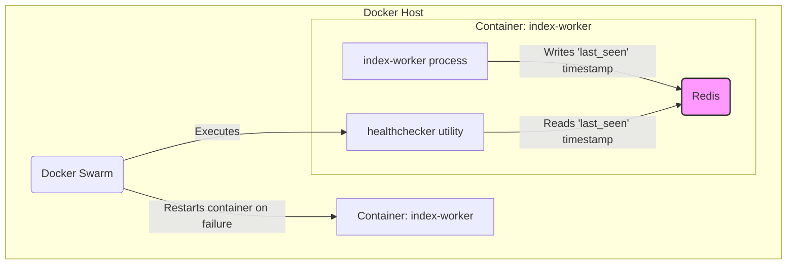

# TON Indexer Health Checker

A lightweight, production-ready Go utility designed to monitor the health of a `ton-indexer` service and enable automated recovery in a Docker Swarm environment.

**Original Project:** [toncenter/ton-indexer](https://github.com/toncenter/ton-indexer)

> **Compatibility Notice:** This integration guide is specifically for version `v1.1.8` of the `ton-indexer`. The author does not guarantee compatibility with other versions.

## 1. Purpose

The `index-worker` component in the TON blockchain indexing pipeline can sometimes enter a "hung" state where it stops processing new blocks, but the process itself does not crash. Standard Docker restart policies are ineffective against this type of silent failure.

This health checker provides an intelligent, external check to determine if the indexer is *actually* working. It does this by checking a timestamp that the indexer writes to a Redis cache. If the timestamp is too old, the health checker exits with a failure code, signaling to Docker Swarm that the container is unhealthy and needs to be restarted.

## 2. Component Relationships

The health checker integrates with the existing `index-worker` and Docker Swarm to create a self-healing system.



## 3. Integration Guide

This guide provides the exact steps to integrate the health checker into your `ton-indexer` project.

### **Step 1: Modify `ton-index-worker/Dockerfile`**

We will use a multi-stage Docker build to compile the Go healthchecker and inject it into the final `index-worker` image without installing the entire Go toolchain.

**Action:** Replace the entire content of `ton-index-worker/Dockerfile` with the following:

```dockerfile
# =================================================================
# Стадия 1: Сборка нашего Go Healthchecker'а из внешнего репозитория
# Это наш новый, добавленный блок.
# =================================================================
FROM golang:1.21-alpine AS healthchecker-builder

# Устанавливаем git, чтобы иметь возможность клонировать репозиторий
RUN apk add --no-cache git

WORKDIR /src

# Клонируем ваш репозиторий с хелсчекером
# Используем --depth 1 для ускорения, так как нам не нужна вся история коммитов
RUN git clone --depth 1 https://github.com/egorkaBurkenya/ton-indexer-healthchecker-go.git .

# Собираем статичный бинарный файл. Это самый надежный способ для встраивания.
RUN CGO_ENABLED=0 go build -o /healthchecker .


# =================================================================
# Стадия 2: Сборка C++ компонентов (ВАШ ОРИГИНАЛЬНЫЙ КОД)
# Этот блок остается без изменений.
# =================================================================
FROM ubuntu:22.04 as builder
RUN DEBIAN_FRONTEND=noninteractive TZ=Etc/UTC apt-get update -y && apt-get -y install tzdata && rm -rf /var/lib/{apt,dpkg,cache,log}/
RUN apt-get update -y \
    && apt-get install -y build-essential cmake clang openssl libssl-dev zlib1g-dev \
                   gperf wget git curl ccache libmicrohttpd-dev liblz4-dev \
                   pkg-config libsecp256k1-dev libsodium-dev libhiredis-dev python3-dev libpq-dev \
                   automake libjemalloc-dev lsb-release software-properties-common gnupg \
                   autoconf libtool \
    && rm -rf /var/lib/{apt,dpkg,cache,log}/

# building
COPY external/ /app/external/
COPY pgton/ /app/pgton/
COPY celldb-migrate/ /app/celldb-migrate/
COPY ton-index-clickhouse/ /app/ton-index-clickhouse/
COPY ton-index-postgres/ /app/ton-index-postgres/
COPY ton-integrity-checker/ /app/ton-integrity-checker/
COPY ton-smc-scanner/ /app/ton-smc-scanner/
COPY ton-trace-emulator/ /app/ton-trace-emulator/
COPY ton-trace-task-emulator/ /app/ton-trace-task-emulator/
COPY tondb-scanner/ /app/tondb-scanner/
COPY CMakeLists.txt /app/

WORKDIR /app/build
RUN cmake -DCMAKE_BUILD_TYPE=Release ..
RUN make -j$(nproc) ton-index-postgres ton-index-postgres-migrate ton-index-clickhouse ton-smc-scanner ton-integrity-checker ton-trace-emulator


# =================================================================
# Стадия 3: Финальный образ (ВАШ ОРИГИНАЛЬНЫЙ КОД + ОДНА СТРОКА)
# =================================================================
FROM ubuntu:22.04
RUN DEBIAN_FRONTEND=noninteractive TZ=Etc/UTC apt-get update -y && apt-get -y install tzdata && rm -rf /var/lib/{apt,dpkg,cache,log}/
RUN apt-get update -y \
    && apt install -y dnsutils libpq-dev libsecp256k1-dev libsodium-dev libhiredis-dev \
    && rm -rf /var/lib/{apt,dpkg,cache,log}/

COPY scripts/entrypoint.sh /entrypoint.sh
COPY --from=builder /app/build/ton-index-postgres/ton-index-postgres /usr/bin/ton-index-postgres
COPY --from=builder /app/build/ton-index-postgres/ton-index-postgres-migrate /usr/bin/ton-index-postgres-migrate
COPY --from=builder /app/build/ton-index-clickhouse/ton-index-clickhouse /usr/bin/ton-index-clickhouse
COPY --from=builder /app/build/ton-smc-scanner/ton-smc-scanner /usr/bin/ton-smc-scanner
COPY --from=builder /app/build/ton-integrity-checker/ton-integrity-checker /usr/bin/ton-integrity-checker
COPY --from=builder /app/build/ton-trace-emulator/ton-trace-emulator /usr/bin/ton-trace-emulator

# --- НАШЕ ВТОРОЕ ДОБАВЛЕНИЕ ---
# Копируем наш скомпилированный healthchecker из самой первой стадии.
# Теперь он будет доступен внутри контейнера по пути /usr/local/bin/healthchecker.
COPY --from=healthchecker-builder /healthchecker /usr/local/bin/healthchecker
# --- КОНЕЦ ДОБАВЛЕНИЯ ---

ENTRYPOINT [ "/entrypoint.sh" ]
```

### **Step 2: Modify `docker-compose.yaml`**

Next, we configure the `index-worker` service to use the new build context and activate the health check.

**Action:** Find the `index-worker` service in your root `docker-compose.yaml` and replace its definition with the following:

```yaml
  index-worker:
    image: toncenter/ton-indexer-worker:${VERSION:-latest}
    # Мы используем наш модифицированный Dockerfile.
    # Контекст сборки теперь - корень проекта, чтобы Dockerfile мог найти все папки.
    build:
      context: .
      dockerfile: ton-index-worker/Dockerfile
    depends_on:
      postgres:
        condition: service_healthy
      run-migrations:
        condition: service_completed_successfully
    secrets:
      - postgres_password
    volumes:
      - ${TON_WORKER_DBROOT:-./}:/tondb
      - ton_index_workdir:/ton_index_workdir
    environment: *index-worker
    networks:
      internal:
    command:
      # Обратите внимание, что здесь теперь список (правильный YAML синтаксис)
      - --pg
      - postgresql://${POSTGRES_USER}@postgres:${POSTGRES_PORT}/${POSTGRES_DBNAME}
      - --db
      - /tondb
      - --working-dir
      - /ton_index_workdir
      - --from
      - "${TON_WORKER_FROM:-1}"

    # --- НАЧАЛО НАШИХ ИЗМЕНЕНИЙ ---
    # Убираем старую политику restart и добавляем новую, управляемую Swarm.
    
    deploy:
      replicas: 1
      restart_policy:
        condition: on-failure
        delay: 10s
        max_attempts: 3
        window: 120s

    healthcheck:
      # Вызываем наш скомпилированный Go-хелсчекер!
      # Docker будет запускать эту команду внутри контейнера index-worker.
      test: ["CMD", "/usr/local/bin/healthchecker"]
      interval: 60s    # Проверять каждую минуту.
      timeout: 15s     # Считать проверку "зависшей" через 15 секунд.
      retries: 3       # После 3 неудачных проверок подряд контейнер будет перезапущен.
      start_period: 3m # Не начинать проверки в первые 3 минуты после старта контейнера.
      
    # --- КОНЕЦ НАШИХ ИЗМЕНЕНИЙ ---
```

### **Step 3: Build and Deploy**

After saving both files, run the following commands from the root of your `ton-indexer` project.

1.  **Rebuild the `index-worker` image:**
    This command will execute the multi-stage build, including compiling the healthchecker.
    ```bash
    docker-compose build index-worker
    ```

2.  **Initialize Docker Swarm (if not already done):**
    This is a one-time setup command for your machine.
    ```bash
    docker swarm init
    ```

3.  **Deploy the stack:**
    This command uses the `deploy` and `healthcheck` configurations to run the services under Swarm's management.
    ```bash
    docker stack deploy -c docker-compose.yaml ton_stack
    ```

Your system is now configured. Docker Swarm will use the healthchecker to monitor and automatically restart the `index-worker` if it becomes unresponsive.

## 4. Healthchecker Configuration

The utility is configured entirely through environment variables, making it ideal for containerized deployments. You can set these in the `environment` section of the `index-worker` service in your `docker-compose.yaml`.

| Variable            | Description                                       | Default         |
| ------------------- | ------------------------------------------------- | --------------- |
| `REDIS_HOST`        | The hostname of the Redis server.                 | `event-cache`   |
| `REDIS_PORT`        | The port of the Redis server.                     | `6379`          |
| `REDIS_STATE_KEY`   | The key in Redis holding the indexer state JSON.  | `last_mc_seqno` |
| `MAX_DELAY_SECONDS` | Max allowed delay in seconds before failure.      | `300`           |
