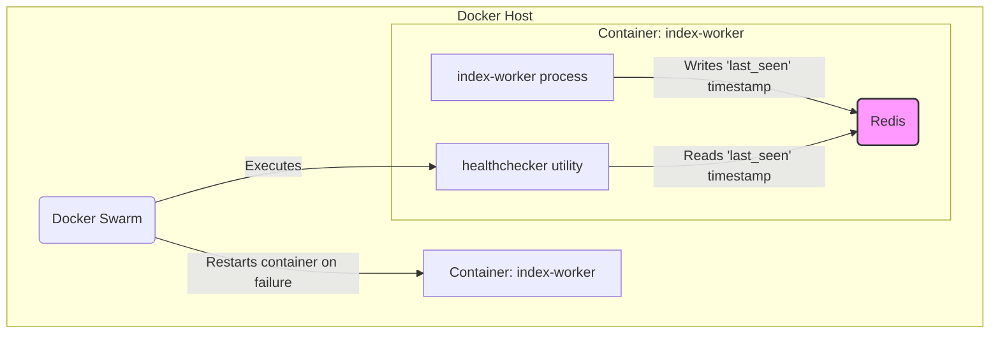

# TON Indexer Health Checker

A lightweight, production-ready Go utility designed to monitor the health of a `ton-indexer` service and enable automated recovery in a Docker Swarm environment.

**Original Project:** [toncenter/ton-indexer](https://github.com/toncenter/ton-indexer)

> **Compatibility Notice:** This integration guide is specifically for version `v1.1.8` of the `ton-indexer`. The author does not guarantee compatibility with other versions.

## 1. Purpose

The `index-worker` component in the TON blockchain indexing pipeline can sometimes enter a "hung" state where it stops processing new blocks, but the process itself does not crash. Standard Docker restart policies are ineffective against this type of silent failure.

This health checker provides an intelligent, external check to determine if the indexer is *actually* working. It does this by checking a timestamp that the indexer writes to a Redis cache. If the timestamp is too old, the health checker exits with a failure code, signaling to Docker Swarm that the container is unhealthy and needs to be restarted.

## 2. Component Relationships

The health checker integrates with the existing `index-worker` and Docker Swarm to create a self-healing system.



## 3. Integration Guide

This guide provides the exact steps to integrate the health checker into your `ton-indexer` project.

### **Step 1: Modify `ton-index-worker/Dockerfile`**

To integrate the health checker, we will add a new build stage to compile the Go binary and then copy it into the final image.

**1. Add the Healthchecker Build Stage**

At the very **top** of `ton-index-worker/Dockerfile`, add the following block. This stage downloads and compiles the healthchecker.

```dockerfile
# =================================================================
# Stage 1: Build the Go Healthchecker from the external repository
# This is our new, added block.
# =================================================================
FROM golang:1.21-alpine AS healthchecker-builder

# Install git to allow cloning the repository
RUN apk add --no-cache git

WORKDIR /src

# Clone the healthchecker repository
# Use --depth 1 for speed, as we don't need the full commit history
RUN git clone --depth 1 https://github.com/egorkaBurkenya/ton-indexer-healthchecker-go.git .

# Build a static binary. This is the most reliable way to embed it.
RUN CGO_ENABLED=0 go build -o /healthchecker .
```

**2. Copy the Compiled Binary**

In the **final stage** of your `Dockerfile` (the one that starts with `FROM ubuntu:22.04`), find the `ENTRYPOINT` instruction. Just **before** the `ENTRYPOINT`, add this line:

```dockerfile
# --- ADDITION ---
# Copy our compiled healthchecker from the very first stage.
# It will now be available inside the container at /usr/local/bin/healthchecker.
COPY --from=healthchecker-builder /healthchecker /usr/local/bin/healthchecker
# --- END OF ADDITION ---

ENTRYPOINT [ "/entrypoint.sh" ]
```

### **Step 2: Modify `docker-compose.yaml`**

Next, configure the `index-worker` service in your root `docker-compose.yaml` to build from the modified `Dockerfile` and use the healthcheck.

**Action:** In your `docker-compose.yaml`, find the service named `index-worker` and make the following changes:

1.  **Add the `build` configuration** to tell Docker to use your local, modified `Dockerfile`.
2.  **Remove the `restart` policy** (e.g., `restart: unless-stopped`), as it will be replaced by the more powerful `deploy` policy.
3.  **Add the `deploy` and `healthcheck` sections** to enable Swarm-managed restarts based on the healthchecker's output.

Your final `index-worker` service definition should look like this:

```yaml
  index-worker:
    image: toncenter/ton-indexer-worker:${VERSION:-latest}
    # Add this build section to use our modified Dockerfile.
    # The build context is the project root, so the Dockerfile can find all source folders.
    build:
      context: .
      dockerfile: ton-index-worker/Dockerfile
    depends_on:
      postgres:
        condition: service_healthy
      run-migrations:
        condition: service_completed_successfully
    secrets:
      - postgres_password
    volumes:
      - ${TON_WORKER_DBROOT:-./}:/tondb
      - ton_index_workdir:/ton_index_workdir
    environment: *index-worker
    networks:
      internal:
    command:
      - --pg
      - postgresql://${POSTGRES_USER}@postgres:${POSTGRES_PORT}/${POSTGRES_DBNAME}
      - --db
      - /tondb
      - --working-dir
      - /ton_index_workdir
      - --from
      - "${TON_WORKER_FROM:-1}"

    # --- START OF OUR CHANGES ---
    # Remove any old restart policy and add the new Swarm-managed one.
    
    deploy:
      replicas: 1
      restart_policy:
        condition: on-failure
        delay: 10s
        max_attempts: 3
        window: 120s

    healthcheck:
      # This calls our compiled Go healthchecker!
      # Docker will run this command inside the index-worker container.
      test: ["CMD", "/usr/local/bin/healthchecker"]
      interval: 60s    # Check every minute.
      timeout: 15s     # Consider the check "hung" after 15 seconds.
      retries: 3       # After 3 consecutive failures, the container will be restarted.
      start_period: 3m # Don't run checks for the first 3 minutes after the container starts.
      
    # --- END OF OUR CHANGES ---
```

### **Step 3: Build and Deploy**

After saving both files, run the following commands from the root of your `ton-indexer` project.

1.  **Rebuild the `index-worker` image:**
    This command will execute the multi-stage build, including compiling the healthchecker.
    ```bash
    docker-compose build index-worker
    ```

2.  **Initialize Docker Swarm (if not already done):**
    This is a one-time setup command for your machine.
    ```bash
    docker swarm init
    ```

3.  **Deploy the stack:**
    This command uses the `deploy` and `healthcheck` configurations to run the services under Swarm's management.
    ```bash
    docker stack deploy -c docker-compose.yaml ton_stack
    ```

Your system is now configured. Docker Swarm will use the healthchecker to monitor and automatically restart the `index-worker` if it becomes unresponsive.

## 4. Healthchecker Configuration

The utility is configured entirely through environment variables, making it ideal for containerized deployments. You can set these in the `environment` section of the `index-worker` service in your `docker-compose.yaml`.

| Variable            | Description                                       | Default         |
| ------------------- | ------------------------------------------------- | --------------- |
| `REDIS_HOST`        | The hostname of the Redis server.                 | `event-cache`   |
| `REDIS_PORT`        | The port of the Redis server.                     | `6379`          |
| `REDIS_STATE_KEY`   | The key in Redis holding the indexer state JSON.  | `last_mc_seqno` |
| `MAX_DELAY_SECONDS` | Max allowed delay in seconds before failure.      | `300`           |
