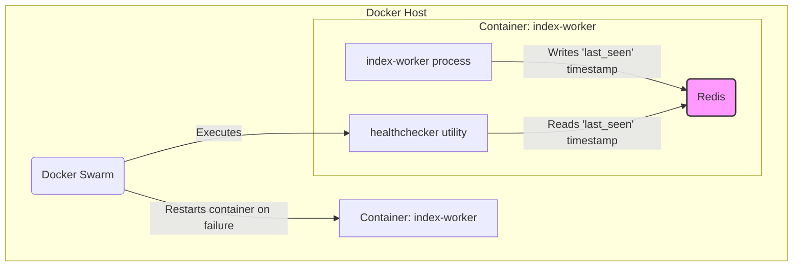

# System Patterns: TON Indexer Health-Checker

## 1. System Architecture

The health-checker operates within a simple but robust architecture designed for containerized environments.

- **Data Flow:** `TON Full Node` -> `index-worker` (Service) -> `PostgreSQL` (Database)
- **Health Monitoring Flow:** `Docker Swarm` -> `healthchecker` (Utility) -> `Redis` (State Cache)

## 2. Key Design Pattern: Orchestrator-Managed Healthcheck

We are explicitly avoiding a pattern where the health-checker utility would directly interact with the Docker API to restart containers. This approach is brittle and insecure.

Instead, we use the **Orchestrator-Managed Healthcheck** pattern.

- **Responsibility:** The Go utility's only job is to determine the health status and report it via its exit code. It is a simple, single-purpose tool.
- **Orchestration:** Docker Swarm is responsible for *acting* on the health status. It handles the lifecycle of the container (killing, restarting) based on the health information it receives.
- **Decoupling:** The health-checking logic is completely decoupled from the container management logic. This makes the system more modular, secure, and reliable.

## 3. Component Relationships

- **`index-worker` process:** The primary application. It periodically writes a "heartbeat" (a JSON object with a `gen_utime` timestamp) to a specific key in Redis.
- **`healthchecker` utility:** A short-lived process executed by Docker Swarm. It reads the heartbeat from Redis, performs the time-delay check, and exits.
- **`Redis`:** Acts as a lightweight message bus or state cache, facilitating communication between the long-running `index-worker` and the ephemeral `healthchecker`.
- **`Docker Swarm`:** The orchestrator that triggers the health check and manages the container's lifecycle based on the outcome.
